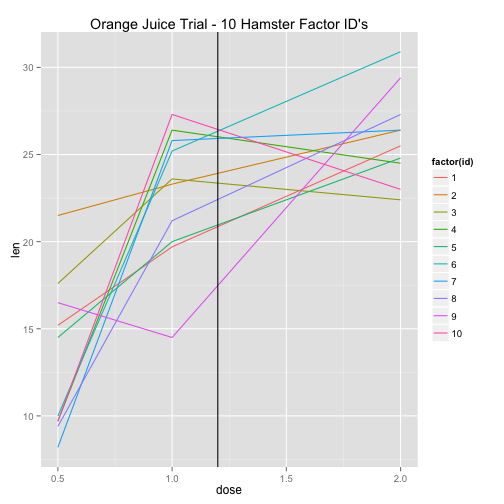

Coursera  - Building Data Applications
========================================================
author:  Shannon Mada
date: December 13th, 2014
font-import: http://fonts.googleapis.com/css?family=Risque
font-family: 'Risque'


The Longer Shinier Teeth Application
========================================================
incremental: true
Our new application will help to sell our products, promote teeth health in hamsters, and further grow the data which demonstrates efficacy of our supplements.

- User interactive
- Simplifies product ordering
- Shares our clinical data 
- Invites participation

The Underlying Code is Simple
========================================================


The Code used for the app is simple & reacts to user inputs.   A key feature --  when user specifies HAMSTERS and DOSAGE, it calculates bottles of our supplement to be ordered.  Here's an example:


```r
roundUp<-function(x) ceiling(max(x)/1)
hamsters=10
dosage = 2
paste("You will need to order the following number of our 10 mg bottles: " ,
                              (roundUp((hamsters * dosage) / 10)))
```

```
[1] "You will need to order the following number of our 10 mg bottles:  2"
```

The Data is Attractive
========================================================
We share our full clinical data set for the user to understand expected results.  Users may select either delivery vehicle -- Orange Juice or Ascorbic Acid -- and see a movable veritcal line to highlight the range of effects at a particular dose.  Here's an example showing user selection of Orange Juice and 1.2 mg.

 

Summary
========================================================

This simple application is ready to publish

- Has our most recent clinical trials embedded
- Features a current photograph of our best model hamster
- Has up to date mail in link for users to share findings
- Intended as a sub page on our master product ordering site

***


*"I love this new application."*

**John J. Rodent, SpokesHamster** 


